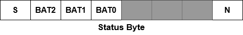

# Wireless Communication

This document details the wireless communication link between the BET-Aerial and BET-Ground platforms.

# Physical Interface

Communications between the devices is handled by a pair of nRF24L01+ 2.4GHz trancievers. These modules are connected to their controllers over an SPI interface. They're each powered by the 3V3 supply powered by their respective MCUs.

# Software Interface

The wireless 2.4GHz trancievers are controlled by the RF24 library for Arduino published by TMRh20. This provides a suite of functions for the modules. This enables opening reading and writing streams at selectable addresses, and the reading and writing of known length messages. This library also performs all the necessary error checking and correction required for the signal to ensure eroneous values aren't accepted.

# Protocol

## Architecture

A controller-target architecture is used in this configuration on two adresses. The BET-Ground platform acts as the controller with the BET-Aerial platform as the target. Discussion of the information sent between devices shall be discussed in terms of the intended data excluding any parity, addressing, or additional information included by the RF24 library for transmission. Communication is performed in terms of discrete transactions. Two addresses are used, GCONT & ADATA.

## Structure of a Transaction

The controller device initiates any transaction with a request byte on the GCONT address.

A request byte contains a series of bit flags as commands for the BET-Aerial platform. The AMG flag requests an image from the AMG8833 sensor. The DIST flag requests the reported distance measured by the ultrasonic sensor. The GORI flag requests the orientation measured by the IMU. The INIT flag requests the device run through its initialization sequence and begin normal operation. The OFF flag requests the device stop its normal operation and wait until next contact. The SORI flag is unique in that it is setting a parameter, namely the target orientation for the gimbal. When SORI is flagged, the request byte is followed by a transmission of the known length orientation.

The target processes this byte, then transmits on the ADATA address all the information noted in the request byte in the order the flags appear in the request byte. These elements are each of a fixed & known length allowing the ground station to request the correct number of bytes on reads. Any response is concluded by a STATUS byte with some information about the status of the BET-Aerial platform.

Three elements of the Status byte are the stability flag, battery indicator, and normal operation flag. The stability flag (S) is active low and indicates if the gimbaling system has performed significant correction in its 8 most recent cycles. The battery indicator (BAT2:0) provides a 3-bit number to estimate the amount of battery life remaining. The normal operation flag (N) is active high and indicates any abnormal operation of the BET-Aerial platform that's been detected.

Written by Carson Hall 2022/10/26